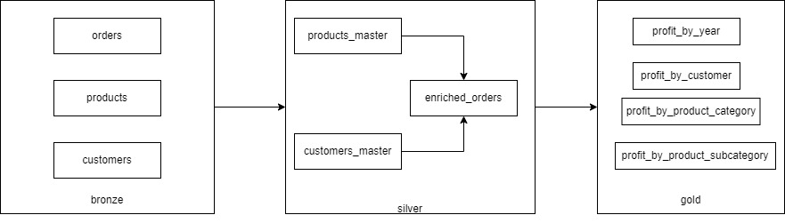

# SDEAssignmentPEI
Repo to store databricks assignment files

To run the code in a databricks environment download `assignment.dbc` file and import in Databricks workspace.

Pre-requisites:

- Cluster is created and attached to notebooks
- Install spark-excel library to the cluster (https://mvnrepository.com/artifact/com.crealytics/spark-excel_2.13/3.5.0_0.20.3)

Documentation:

The developed pipeline follows the [medallion architecture](https://www.databricks.com/glossary/medallion-architecture):

#### Raw(bronze tables)

- products
- orders
- customers

#### Silver tables

- products_master
- customers_master
- enriched_orders

#### Gold tables:

- profit_by_year
- profit_by_product_category
- profit_by_product_subcategory
- profit_by_customer

